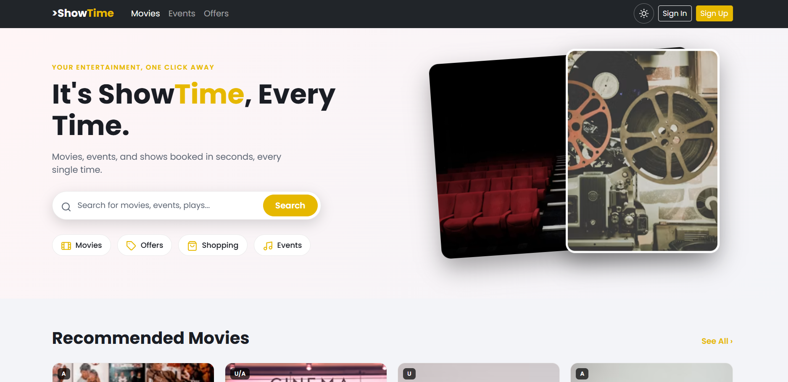

# ShowTime

A movie and event booking landing page built with Bootstrap 5, custom CSS, and vanilla JavaScript.

## Live Demo
Not deployed yet

## Screenshot


## Built With
- HTML5
- CSS3 (custom properties, dark/light theme toggle)
- Bootstrap 5
- Vanilla JavaScript

## Features
- Dark/light theme toggle with saved preference (localStorage)
- Responsive hero section with search bar
- Movie and event card grids
- Offers & deals section with promo codes
- Fully custom color theme via CSS variables, including Bootstrap component overrides

## Getting Started

### Prerequisites
- A web browser (no dependencies needed)

### Installation
```bash
git clone https://github.com/harshilbhojwani/showtime.git
cd showtime
```
Then open `index.html` in your browser.

## What I Learned
Built as Sprint 2 of the GeeksforGeeks MERN course. This project taught me how to work with Bootstrap alongside custom CSS, override Bootstrap's default component classes for a custom theme, and connect JavaScript to a live dark/light mode toggle.

## Notes
Built as part of Sprint 2 (Bootstrap & JavaScript Foundations) of the GeeksforGeeks MERN Full Stack course.